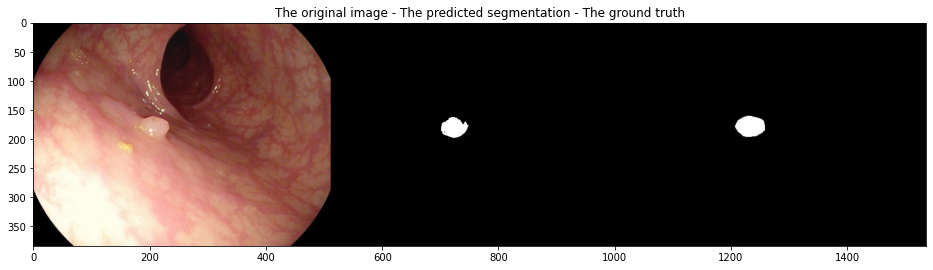
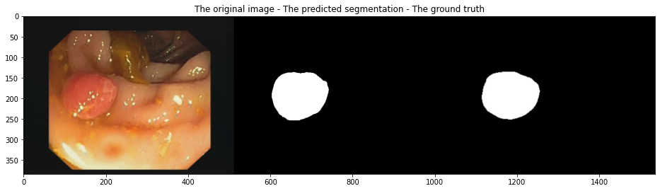
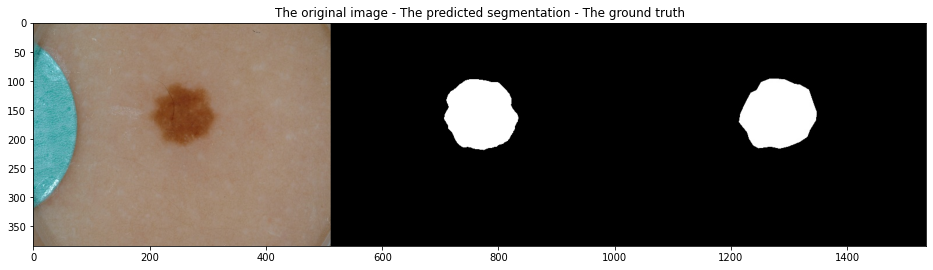
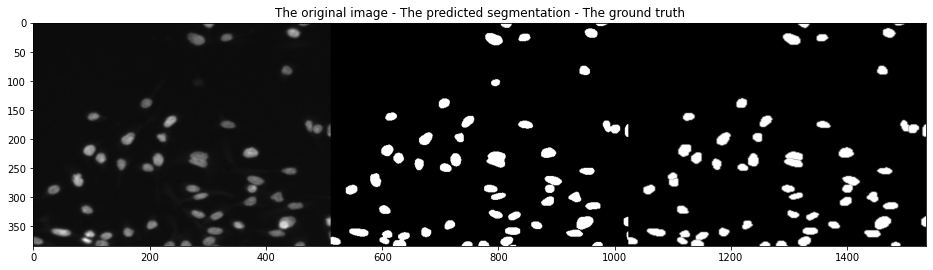

# Medical-Image-Segmentation
This is an implementation of double-unet architecture for medical image segmentation.

## Datasets
<ol>
  <li>MICCAI 2015 Segmentation challenge(CVC-ClinicDB for training and ETIS-Larib for Testing)</li>
  <li>CVC-ClinicDB</li>
  <li>Lesion Boundary segmentation challenge/li>
  <li> 2018 Data Science Bowl challenge</li>
 </ol>
 
 ### Data
 We first split the dataset into training, validation, and testing sets(80%, 10%, 10%). We then apply different
 data techniques to train set. Therefore, for each image, 25 different images are created.
  
 ## Architecture
 Double-unet model is based on two u-net based networks.
 
 #### Network 1
 * Input = image
 * Encoder = VGG-19 (pre-trained)
 * Decoder = four blocks consist of upsampling ، skip_connection, Conv2D, Conv2D,Squeeze_excite_block 
 * Output = sigmoid function
 
 #### Network 2
 * Input = network1_output * image
 * Encoder = u-net encoder
 * Decoder = similar to network 1 decoder
 * Output = sigmoid function
 
 This is the architecture of the double-unet model.  

### Metrics
* Precision
* Recall
* mIoU
* DSC

 ## Results
The model is trained on CVC-ClinicDB and tested on the MICCAI dataset.  

The model is trained and tested on CVC-ClinicDB.  

The model is trained and tested on Lesion Boundary segmentation challenge.  

The model is trained and tested 2018 Data Science Bowl Challenge.  

## References: 

[1] [DoubleU-Net: A Deep Convolutional Neural
Network for Medical Image Segmentation](https://arxiv.org/pdf/2006.04868.pdf)
